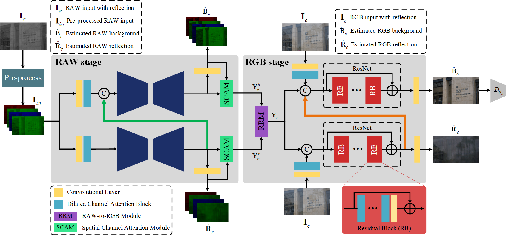

# Real-scene Reflection Removal with RAW-RGB Image Pairs

An official implementation code for paper "Real-scene Reflection Removal with RAW-RGB Image Pairs"

> **Abstract:** 
Most brands of modern consumer digital cameras nowadays are able to provide RAW-RGB image pairs conveniently, even in the automatic mode. RAW images store pixel
intensities linearly related to the radiance, which could be beneficial for the image reflection removal (IRR) task. 
However, existing IRR solutions, usually directly restoring the background in the non-linear RGB domain, severely overlook the valuable information conveyed by readily-available RAW images. Such
a negligence may limit the performance of IRR methods on real-scene images. 
To mitigate this deficiency, we propose a Cascaded RAW and RGB Restoration Network (CR3Net) by leveraging both the RGB images and their paired RAW versions. 
Specifically, we firstly separate background and reflection layers in the linear RAW domain, and then restore the two layers in the non-linear RGB format by converting RAW features into the
RGB domain. 
A novel RAW-to-RGB module (RRM) is devised to upsample these features and mimic pointwise mappings in the camera image signal processor (ISP). 
In addition, we collect the first real-world dataset that contains paired RAW and RGB images for IRR. Compared with state-of-the-art approaches, our method achieves a significant performance gain of about 2.07dB
in PSNR, 0.028 in SSIM, and 0.0123 in LPIPS tested on the captured dataset. 

## Network Architecture



## Requisites

* Pytorch 1.6.0
* Python 3
* Linux

## Test

### Prepare Test Data

Download and unzip the [test set](https://drive.google.com/file/d/1pnSjX1te9DrVMotnnL8X3iwJGYb8Fjw1/view?usp=sharing), and then copy them to `datasets`.

### Download Pre-trained Model

Download and unzip our [pre-trained model](https://drive.google.com/file/d/1mCQbBi35sM9hMOxA1pjDrWvWfM-hf7Ya/view?usp=sharing), and then copy them to `checkpoints/RAW_RGB_RR`.

### Run

You can run `bash test.sh`
or equivalently:
```python
python test.py --dataroot datasets --name RAW_RGB_RR --model RAWRR --dataset_mode rawrr  --preprocess "" --no_flip --epoch final --gpu_ids 0
```

## Acknowledgement

Our code is based on [IBCLN](https://github.com/JHL-HUST/IBCLN).
